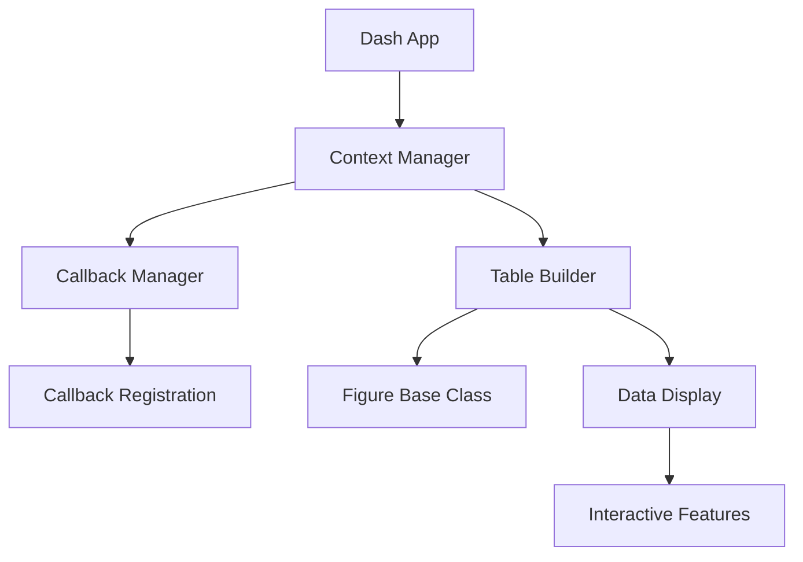

# Plotly Labs

# Dynamic Callbacks - Interactive Data Table with Custom Callbacks Dashboard Project

## Project Overview
This project implements a dynamic web-based dashboard using Dash that displays interactive data tables. The application allows users to create and interact with multiple data tables through a simple interface.

> [!TIP]
> How Callbacks Work in the Main Thread:
>
> 1. Registration Phase
>    When you define a callback using the @callback decorator, Dash registers it during the application initialization. Callbacks are stored in the app's _callback_list internally.
>
> 2. Event Loop Integration
>    Dash runs on Flask's development server by default. The callbacks are handled asynchronously using Flask's event loop. Each callback is executed in the main thread, but they're managed through an event queue
>
> 3. Threading Behavior
>    By default, callbacks run sequentially in the main thread. When multiple callbacks are triggered:
>    * They form a queue
>    * Execute one after another
>    * Block until completion


## Core Components

### 1. Base Architecture
```python
class Figure:
    """Base abstract class defining the interface for all figure components"""
    - build(): Creates figure components
    - register_callback(): Handles callback registration
```

### 2. Table Implementation
```python
class TableBuilder(Figure):
    """Implements interactive data tables with the following features:
    - Paginated data display
    - Cell selection functionality
    - Dynamic cell information display
    - Customizable styling
    """
```

### 3. Main Application
- Creates a Dash web application
- Implements dynamic table generation
- Manages application state through Context
- Handles user interactions via callbacks

## Key Features

1. **Dynamic Table Generation**
   - Tables created on-demand via button click
   - Support for multiple data sources
   - Automatic pagination for large datasets

2. **Interactive Elements**
   - Cell selection capability
   - Real-time display of selected cell information
   - Responsive user interface

3. **Data Management**
   - Supports pandas DataFrames as data source
   - Flexible data structure handling
   - Efficient data updates

## Technical Architecture



## Usage Example

```python
# 1. Initialize the application
app = dash.Dash(__name__)

# 2. Set up data sources
sample_df1 = pd.DataFrame({"A": [1, 2, 3], "B": [4, 5, 6]})
sample_df2 = pd.DataFrame({"X": [100, 200], "Y": [300, 400]})

# 3. Configure tables and context
Context(
    figures=[
        TableBuilder(sample_df1),
        TableBuilder(sample_df2),
    ],
    callback_manager_type=CallbackManager,
)

# 4. Run the application
app.run_server(debug=True)
```

## Key Components Interaction

1. **Data Flow**
   - Raw data → TableBuilder
   - TableBuilder → Interactive Components
   - User Interaction → Callback System
   - Callback System → Updated Display

2. **State Management**
   - Managed by Context class
   - Centralized callback registration
   - Coordinated figure updates

3. **User Interface**
   - Simple button interface
   - Dynamic table container
   - Interactive cell selection
   - Informative alerts

## Technical Requirements

- Python with Dash framework
- Pandas for data handling
- Dash Bootstrap Components for styling
- Modern web browser for display
